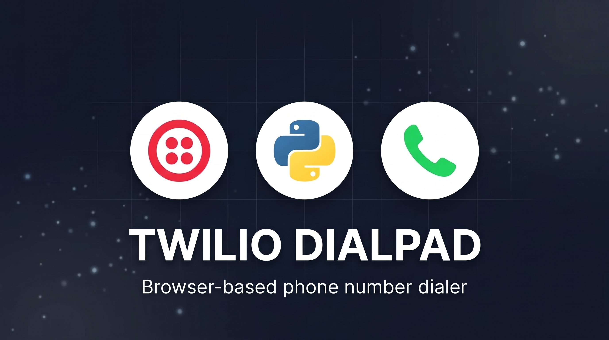
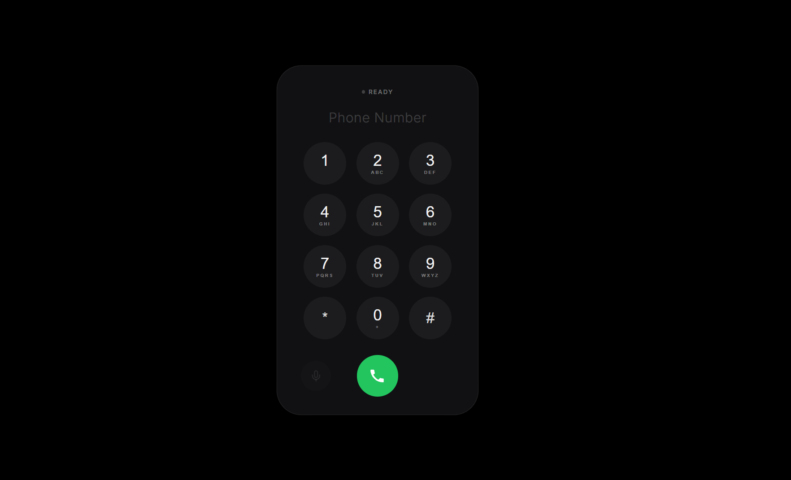

# Twilio Dialpad

A minimal, browser-based phone dialer for placing and receiving calls through Twilio.

---

<div align="center">
  
</div>

---

## Preview

<div align="center">
  
</div>

---

Twilio Dialpad is a lightweight, browser-based WebRTC phone dialer built with FastAPI and Twilio Voice SDK. It allows you to place outbound calls, toggle mute, and send DTMF keypad tones directly from your web browser with zero setup bloat.

---

## Quick Start

```bash
git clone https://github.com/mubashirsidiki/twilio-dialpad.git
cd twilio-dialpad
uv sync
cp .env.example .env
```

---

## Twilio Setup & Configuration

Follow these steps to obtain your credentials in the [Twilio Console](https://1console.twilio.com/):

### 1. Account Creation
* Create an account on Twilio if you haven't already.
* Activate the free trial if available in your region. If trial is unavailable, top up at least $20 USD to get started.

### 2. Purchase an Outbound Number
1. In the left sidebar, navigate to **Products & Services** (2nd section) → **Numbers and Sensors** → **Overview**.
2. Click **Set up a new phone number**.
3. Complete the required regulatory/verification profile (name, address, government-issued ID, and face verification; you can complete this on your phone if your webcam quality is low).
4. Purchase and copy your new phone number. This acts as your outbound caller ID:
   ```env
   TWILIO_NUMBER_FOR_MAKING_CALLS=+180************
   ```

### 3. Destination Number (Optional)
* Pre-fill the phone number you call most frequently so you don't have to retype it every time (you can still dial any number manually on the dialpad):
   ```env
   NUMBER_FOR_RECEIVING_CALLS=+148************
   ```

### 4. Create API Key & Secret
1. In the sidebar, go to **Develop** (3rd section) → **API keys & creds** → **API keys & tokens**.
2. Under the **API Keys** tab, click **Create API Key**.
3. Set the key type to **Standard** and click create.
4. Copy both the SID and the Secret (the secret is shown only once):
   ```env
   TWILIO_API_SID=SKf9****************************
   TWILIO_API_CLIENT_SECRET=pl7G****************************
   ```

### 5. Get Account SID
1. Return to **Develop** → **API keys & creds** → **API keys & tokens**.
2. Switch to the **Auth Tokens** tab.
3. Copy your **Account SID**:
   ```env
   TWILIO_ACCOUNT_SID=AC24****************************
   ```

### 6. Create a TwiML App
1. In the sidebar under **Develop**, click **TwiML apps**.
2. Click **Create TwiML App**, enter a name, and save.
3. On the app details page, copy the App SID located directly under the main heading (starts with `AP...`):
   ```env
   TWIML_APP_SID=AP27****************************
   ```

---

## Running the Application

### 1. Start the Backend Server
```bash
uv run python backend.py
```
The server runs locally at `http://localhost:8000`.

### 2. Expose with ngrok
In a separate terminal, start your tunnel:
```bash
ngrok http 8000
```
Copy your forwarding HTTPS URL (e.g. `https://your-domain.ngrok-free.app`).

### 3. Configure TwiML Voice Webhook
1. In the sidebar under **Develop**, click **TwiML apps**, then select your app.
2. Under the **Voice Configuration** section, in the **Request URL** box, paste your ngrok URL (**don't forget to append `/voice` at the end**):
   ```
   https://your-domain.ngrok-free.app/voice
   ```
3. Ensure HTTP Method is set to **`HTTP POST`** and click **Save**.

### 4. Open the Dialer
Open your ngrok URL or `http://localhost:8000` in any modern web browser to make calls.

---

## License

Licensed under the [Apache License, Version 2.0](LICENSE).
